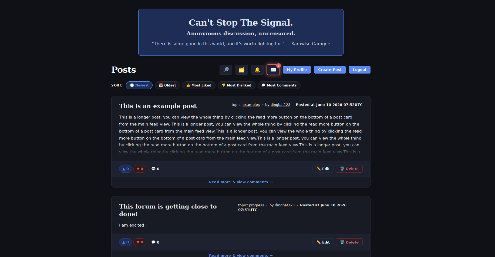

# cantstopthesignal



# Features
CantStopTheSignal is a total NO JAVASCRIPT server side rendered Kotlin webservice built with ktor and thymeleaf. It supports creating posts with titles topics and 
contents. Lists of all popular topics can be viewed from the file icon from the feed fiew. Post contents and topics can  also be searched with the magnifying glass 
icon in the main feed. It can be made invite only in which case you will need an admin generated UUID invite code to join otherwise you just require
a username and password and optional public key that will go on your profile for others to see so they can import it locally and encrypt messages to you. You can log in via your PGP
key on file, and the site owner can make PGP login mandatory, entirely disallowing password login altogether. PGP challenge based login brings a lot of extra security that password login can 
not bring. Private message conversations  are supported with up to 15 members and a configurable group name. Message conversations have timestamps so you can see when 
messages were sent, by who etc. YOu will receive notifications when people message you, you will receive notifications anytime someone comments on your post, 
likes your post, likes your comment, and replies to your comment. You can upload a bio once signed up that users will see when they click your name in the 
comment section or on a post as the author. You can independently sort through topic posts so you can filter posts by topic and then by likes dislikes comment count
new old etc. There is an admin panel that is accessible through the 'My Profile' button from the main feed , if you are an admin or moderator. Moderators generally have a more read only view and can suspend users
or remove posts and comments and admins can view the logs of moderators, create new moderators or admins, suspend signups etc. 

# Development Note
This will be intended to be used through the I2P network and I do plan to make at least some pluggable values such as MOTD, website name etc so others can use my work to host their own personal forum websites in a safe, secure manner. I2P is ideal for this due to the architecture of the network protocol itself, Tor CAN be used however without TLS the final node will see the plaintext, now will they know what it's for if it's just a random username and password? Probably not, but if anything in there is identifiable or you use your name or something you use elsewhere along with a password you use elsewhere, that is no-bueno. I am planning to set this up in a way that will be as accessible as possible for others to host their own, and I am going to implement nice-to-haves such as suspending signups in the case of bombardment, or straight up turning on invite-only mode in which UUID strings can be generated by admins or moderators to be given to people who can then use that UUID to sign up. Giving the person choosing to use my software more control over what kind of social site they wish to run. 

# My Philosophy
A great power we have, is the ability to see beyond appearances. That ability, and sharing it with others, can pave the way for change previously thought impossible. What was once a hopeless prison, with bars of steel, becomes a chrysalis for meaningful change. Free, open, uncensored communication is what allows these prison walls to shift into something more malleable. Sharing your observations, principles, and beliefs can help others to grow. The butterfly does not exit the chrysalis by taking the front door, there is no door. It escapes the chrysalis by growing to the point where it can be no longer be contained by it. With that moment giving birth to something the caterpillar could not have ever imagined. 

My vision for this project, is to allow free, open communication about deception we endure, about false realities we are fed, false limits imposed upon us, false narratives carefully crafted and engineered to steer our emotion and therefore our thoughts, beliefs, and perception by extension. This, in turn, leads to real growth and awareness. And growth, will lead to the eventual rupture of the chrysalis leading to a future nobody thought was possible. The walls are showing signs of cracking. It is not over yet, but through internal transformation made more easily possible via open communication, we can change the world together. What thrives on the darkness of deception, cannot survive the blinding light of truth. 

"And I saw heaven opened, and behold, a white horse, and He who sat on it is called Faithful and True, and in righteousness He judges and wages war. His eyes are a flame of fire, and on His head are many crowns; and He has a name written on Him which no one knows except Himself."

"असतो मा सद्गमय तमसो मा ज्योतिर्गमय मृत्योर्माऽमृतं गमय"

"From the unreal lead me to the real! From the darkness lead me to the light! From death lead me to immortality!"

The sun will rise again, even after the darkest night.


## Building & Running
To build or run the project, use one of the following tasks:


| Task | Description |
|------|-------------|

If the server starts successfully, you'll see the following output:
```
2024-12-04 14:32:45.584 [main] INFO  Application - Application started in 0.303 seconds.
2024-12-04 14:32:45.682 [main] INFO  Application - Responding at http://0.0.0.0:8080
```
